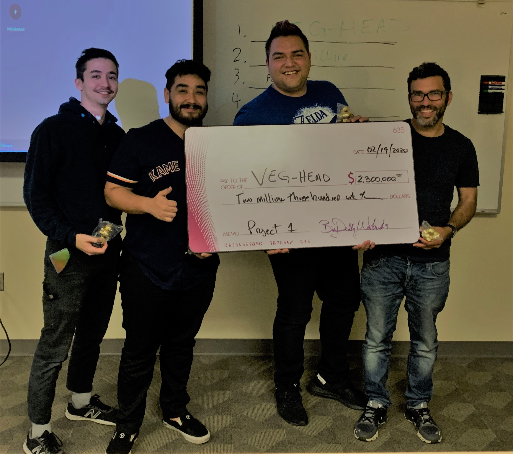

 

We did it. We finished the first group project and we got an initial funding of 2.3 million dollars for our web app. Our app is called [VEGHEAD](https://github.com/yarocruz/veg-head). You can use it to find vegetarian recipes and restaurants that offer vegetarian options. It uses a couple of API's to get the data.

In all honesty I didn't do much for this project, but that's ok. I definitely participated, but the other guys were the ones that really hustled on this and they deserve the credit. 

There's a lot I learned from this experience. Group dynamics, communication, using Git and Github, pull requests and merge conflicts. I think the next projects are gonna go a bit smoother. 

Next week we start crossing to the other side. The server side. 