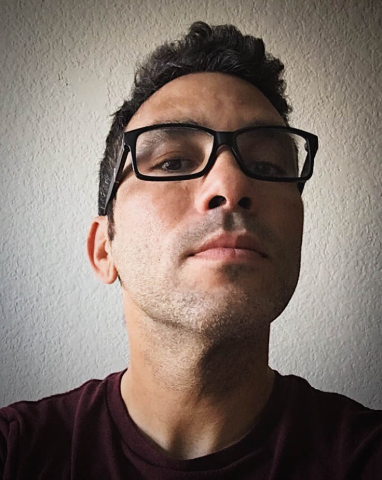

 Hi. My name is Yarosky Cruz. I'm originally from Puerto Rico, but been living in Central Florida for almost a decade now.

I've been making websites for a least a decade. In 2017 I finished my degree in Interactive Design. I can easily fullfill the role of a Web Designer or Junior Front End Developer. Even though my background is in Design, my main focus at the moment is Web Development. I'm currently doing the UCF Coding BootCamp. 

I still love Design. I will always care about how things look. But I also want to go beyond websites and start making web apps.  

When I'm not slinging code I'm hanging out with my beautiful girlfriend and my dog Oliver. 

