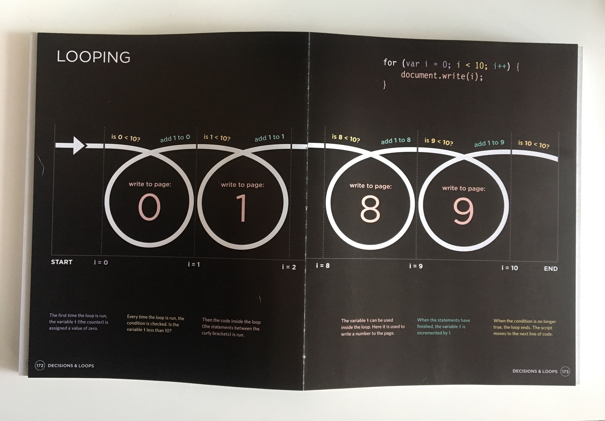

 

After our two weeks of holiday break we did one more day of HTML and CSS and covered some more of Bootstrap. We had been assigned the [second homework](https://github.com/yarocruz/responsive-portfolio) which was to recreate the portfolio we made on our first assignment and add Bootstrap to it. We were also encouraged as an optional bonus assignment to make the [original site](https://github.com/yarocruz/portfolio) as responsive as possible by just using media queries. This was Day 6, technically still part of Week 2.

Overall this was a good refresher for me. Having the option to use a library like Bootstrap is pretty darn awesome. It definitely takes you way less time to make a website responsive with Bootstrap than coding your own CSS and Media Queries. But I still encourage anyone that's still relatively new to HTML and CSS to keep making sites for a little while without Bootstrap. Unless there's a need to prototype something quickly, you should attempt to layout a site a couple of times with CSS. First, when you write your own CSS you learn to organize yourself. You think more about what class names to give to elements. This also makes you question your HTML structure. I know that 200-plus lines of CSS code looks intimidating at first, but it's all a matter of taking it line by line. In the end, this will make you appreciate Bootstrap even more and bend it to your will. You will eventually master flex box, CSS Grid, and discover the magic of [SASS](https://sass-lang.com/). You will rarely have to float and clear-fix anything again.

## Jumping into JavaScript

On Day 7 we officially started with JavaScript. We started with the basics like declaring variables. The different value types like numbers, strings, and booleans. We used the browser's alert, prompt, and console.log functions. We were introduced to Arrays and using conditional logic with if / else statements.  

Day 8 was particularly interesting. It's the first time I have worked with a group on any type of coding project. It was a small exercise, but I was completely stumped for a couple of minutes when we were asked to pseudocode the game Paper Rock Scissors. It was messy. Confusing. But at the same time I loved the challenge. All we knew was that we would have to use conditionals for winning results and Math.random for the computer to make 'random' choices.

On Day 9 we started with Functions and Objects. Our last project was to create an application that would detect your OS by using the window object and it's properties and also detect your location. This was hard. But in the end I started to figure it out.

It's been interesting. The challenge level has definitely gone up a notch. Some members of my study group are starting to feel overwhelmed. Other Bootcampers look like they're starting to fall behind a bit. 

This stuff isn't easy. And it's not going to get any easier. Compared to the time it takes to be fluent with HTML and CSS, getting a solid understanding on JavaScript takes double or even triple the time. 

Take Functions for example. They seem pretty straightforward. They are a thing that wraps around a chunk of code that you can reuse. But they also have arguments and most of the time need a return keyword. This part isn't as straightforward. 

If you're a fellow Bootcamper reading this, my advice is to put in that extra time outside of class. Write code by hand for a bit. Use white boards or pen and paper. Draw what a loop does. Think of the open and close parenthesis of a function '()' as a button that gets pressed. If that button doesn't get pressed, if that button isn't there, that function won't do anything. (Unless that function is thrown as an argument in another functions). 

Keep pushing. We only have 21 more weeks to go.