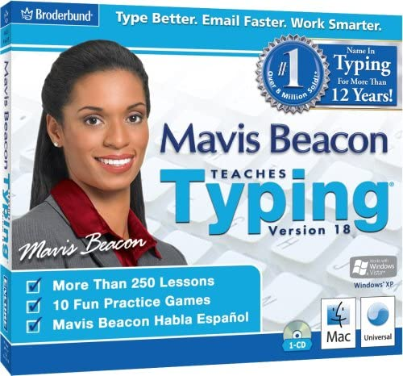

The following list is a jumble of tips, ideas, and musings about what has helped me in my journey to learning to code. Some of them seem obvious, but you know what they say about obvious things. 

- Learn to type. Seriously, like really learn to type. Get a Mavis Beacon CD-ROM. Lol. Go to [typing.io](https://typing.io/) if you never have, take a test, cry a little, and then take another one, and do another one until you get competent. If you're always pecking your keyboard you're not gonna get too far as a coder no matter how much intellisence your editor has.
- Write code by hand occasionally. Yes, just with pencil and paper. Don't go crazy and write like 500 lines, but write little blocks at a time. Write an old-school for loop in a notebook that console.logs the string "papi" 10 times. See if you can do that by memory with just pencil and paper. No syntax highlighting. For example, when I started learning the ES6 reduce array method it wasn't until I wrote it by hand that I got a birds eye view of how it works.
- Write code in Textedit, Notepad, or just write plain text in your Editor. Similar to writing by hand, forcing yourself to type from memory, without syntax highlighting, and without all the cool enhancements that Text Editors and IDE's provide helps a lot when learning the basics of syntax.
- White-board code. I haven't been doing this as much, but our Bootcamp provided us with small whiteboards to do pseudo coding and it helps. It has the same effect as writing code in pen and paper. I haven't experienced it myself, but I've been told that some coding job interviews ask you to whiteboard up a coding problem.  
- Read code. Decode code. Specially other peoples code. If you're on Github find a JavaScript project and take some time to just read code. Take this even further and write a "code manual" to explain what the code is doing. 
- Comment your code. I'm still trying to get better at this myself. Get in the habit of doing this earlier than later. Your code is going to be looked at in the future either by someone else or your future self. Be consistent with your code formatting as well. 
- As soon as you get a chance, work with another coder. Getting a second perspective, seeing how another person thinks and writes code bumps up your neural paths when you're learning this stuff.
- Debug code. Related to the above, as soon as you get a chance, debug code. Try to see if you can help somebody out with their code. Fix code. Learn about refactoring.
- Try another language. Nothing crazy. Just an intro. Do a hello world in another language. Do an intro to Python, PHP, or Ruby. Pick one that you're curious about. For example, the dot **[.]** to concatenate strings in PHP made way much more sense to me for some reason than using the + sign in JS. This gave my brain a good "map" between those two syntactical differences. Tho I avoid as much as I can concatenating strings and instead use template literals.
- Finally, learn your Text Editor / IDE. I recommend to only start digging deep into IDE magic only when you've reached a competent level with your typing. Do learn your basic shortcuts while you're starting, and please let Emmet do its magic. But don't get into the more advanced stuff if you're still a pecker. For me you're a competent typer when you don't have to peek at the key's to find where the letter z is. You're decent when you don't think about typing when you're typing. Only after you reached that level I recommend digging into snippets, learning shorthands like **.div.container.flex.font-black** and press the Tab key in an HTML file. You're welcome. Learn to multi select. Customize your editor to your liking. Add formatting tools like Prettier if you haven't already. Learn your tool.
   