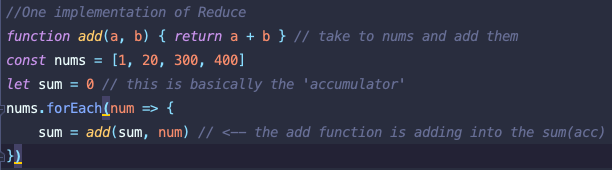
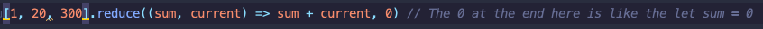
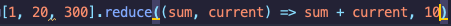
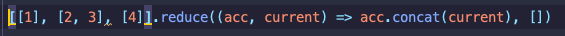

I've known about the **Array.reduce** method for a bit, but I had a superficial understanding of how it actually worked. All I knew was that it would take an array of values, and reduce it down to one value.

The example above is summing all the numbers in the array, but I mostly just had this memorized and when I saw examples of reduce being used for in other contexts I always got confused. It wasn't until recently when it all finally clicked. Specifically, it wasn't until I went through an [Execute Program's](https://www.executeprogram.com/courses/javascript-array) course on JavaScript arrays. 

Lets break the above down a bit:

We have an add function that can take two arguments, a and b, numbers basically, and return the addition of a and b. Easy peasy. We got an array of numbers [1, 20, 300, 400]. We're also starting a sum variable with a value of 0. Finally, we're doing a .forEach on the array of numbers and storing in the sum variable the return value sum + num, and num here is each number in the array. So in the first iteration we are doing 0 + 1, second iteration we are doing 1 + 20. Third, 21 + 300, and last iteration 321 + 400 which will equal in the end to 721.

Another thing to note about the reduce function, is that it has a second optional argument for the starting accumulator value. 

If you omit the value, the accumulator value will start and take the value of the first item in the array.

With this one we will end up at 331.

What about using reduce for other things other than math operations? This is when things start to get interesting. Have you ever tried to flatten an array of arrays into just one single array. Basically taking this [ [1, 3, 'pony'], [1], [true]] into this [1, 3, 'pony', 1, true] with a for loop. Trust me, it's not fun. With reduce this is a bit straight forward.

The above translates as first iteration [1].concat[2,3], then on second iteration the accumulator, the acc, is [1,2,3] and we concat [4] to it, and we end up with [1, 2, 3, 4]. We're giving an empty array[] as the second argument just in case you try to do reduce on an empty array. If you do try to reduce on an empty array without having a default value for the accumulator you will get a type error. For things like summing up an array of numbers it's safer to omit that second value, but with other operations it is best to to start with a value. 

Reduce is tricky, and it took me while to finally get a grip on it, so I hope this helps clarify some of its nuances. 